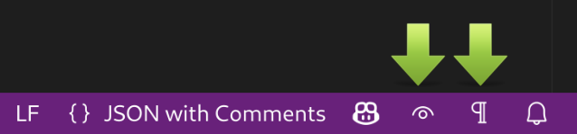

# Easy Toggle Settings for Visual Studio Code

[](https://github.com/mhagnumdw/vscode-easy-toggle-settings/actions/workflows/ci.yml)
[](https://codecov.io/github/mhagnumdw/vscode-easy-toggle-settings)
[](https://marketplace.visualstudio.com/items?itemName=mhagnumdw.easy-toggle-settings)
[](https://marketplace.visualstudio.com/items?itemName=mhagnumdw.easy-toggle-settings)

## Features

Allows you to quickly and easily toggle any VS Code setting directly from the status bar.

You choose which settings to toggle. A button is added to the status bar for each.

Perfect for settings you frequently toggle.


## Installation

Install through VS Code extensions, searching for `Easy Toggle Settings`. Or go to  [Visual Studio Code Market Place: Easy Toggle Settings](https://marketplace.visualstudio.com/items?itemName=mhagnumdw.easy-toggle-settings).

## Usage

For example, let's say we want to toggle these settings:

- `editor.codeLens` between `true` and `false`
- `editor.renderWhitespace` between `"none"` and `"all"`

Open global settings (`Ctrl Shift P > Open user settings json`) and add at the end:

```json
"easy-toggle-settings.items": [
  {
    "property": "editor.codeLens",
    "icon": "eye",
    "values": [true, false]
  },
  {
    "property": "editor.renderWhitespace",
    "icon": "whitespace",
    "values": ["none", "all"]
  }
]
```

> Icons can be found at [Codicon](https://code.visualstudio.com/api/references/icons-in-labels#icon-listing)

After saving the settings, the icons will appear in the status bar. Each click will toggle the setting between the declared values.



🎉 You can now do this for any VS Code setting! 🥳

## Extension Settings

This extension contributes the following settings:

- `easy-toggle-settings.enabled` (`boolean`, default: `true`)  
  Enables or disables the extension functionality.

- `easy-toggle-settings.items` (`array`, default: `[]`)  
  List of settings to toggle. Each item must include:
  - `property` (`string`): Full name of any vscode setting (e.g., `editor.codeLens`)
  - `icon` (`string`): [Codicon](https://code.visualstudio.com/api/references/icons-in-labels#icon-listing) icon name (e.g., `eye`, `whitespace`)
  - `values` (`array`): At least two unique values to cycle through

## Release Notes

See [CHANGELOG](CHANGELOG.md).

## Contributing

1. Fork → Branch → Commit → Push → Open PR
2. Found a bug? [Open an Issue](https://github.com/mhagnumdw/vscode-easy-toggle-settings/issues)
