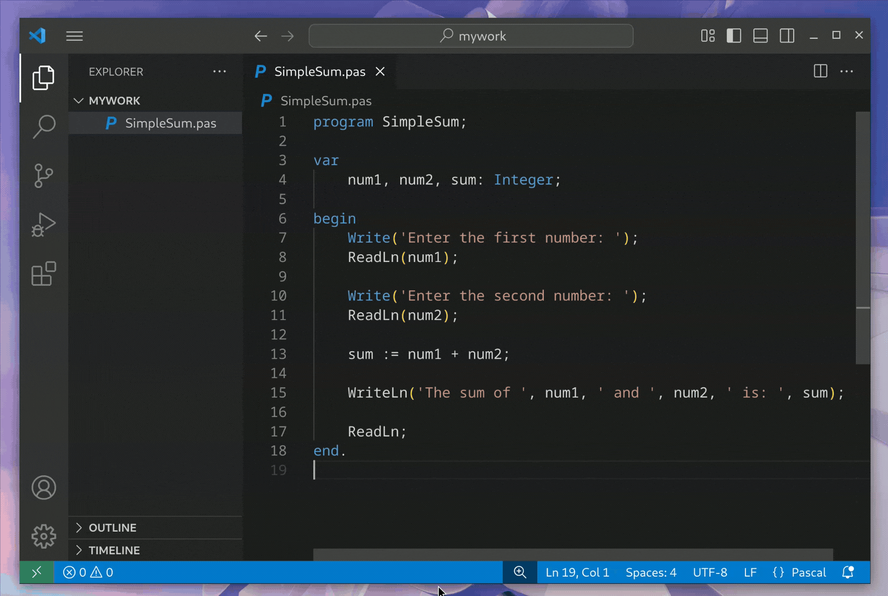

# Toggle Settings for Visual Studio Code

## Features

Allows you to quickly and easily toggle any VS Code setting directly from the status bar.

You choose which settings to toggle. A button is added to the status bar for each.

Perfect for settings you frequently toggle.

// TODO: add gif below



## Installation

Install through VS Code extensions, searching for `Toggle Settings`. Or go to  [Visual Studio Code Market Place: Toggle Settings](https://marketplace.visualstudio.com/items?itemName=mhagnumdw.vscode-toggle-settings).

## Usage

For example, let's say we want to toggle these settings:

- `editor.codeLens` between `true` and `false`
- `editor.renderWhitespace` between `"none"` and `"all"`

Open global settings (`Ctrl Shift P > Open user settings json`) and add at the end:

```json
"vscode-toggle-settings.items": [
  {
    "property": "editor.codeLens",
    "icon": "eye",
    "values": [true, false]
  },
  {
    "property": "editor.renderWhitespace",
    "icon": "whitespace",
    "values": ["none", "all"]
  }
]
```

> Icons can be found at [Codicon](https://code.visualstudio.com/api/references/icons-in-labels#icon-listing)

After saving the settings, the icons will appear in the status bar. Each click will toggle the setting between the declared values.


🎉 You can now do this for any VS Code setting! 🥳

## Extension Settings

This extension contributes the following settings:

- `vscode-toggle-settings.enabled` (`boolean`, default: `true`)  
  Enables or disables the extension functionality.

- `vscode-toggle-settings.items` (`array`, default: `[]`)  
  List of settings to toggle. Each item must include:
  - `property` (`string`): Full name of any vscode setting (e.g., `editor.codeLens`)
  - `icon` (`string`): [Codicon](https://code.visualstudio.com/api/references/icons-in-labels#icon-listing) icon name (e.g., `eye`, `whitespace`)
  - `values` (`array`): At least two unique values to cycle through

## Release Notes

Users appreciate release notes as you update your extension.

### 1.0.0

Initial release of ...

### 1.0.1

Fixed issue #.

## Contributing

1. **Fork** the repository
2. Create a **branch** for your feature/fix (`git checkout -b feat/amazing-feature`)
3. Commit your changes (`git commit -m 'Add amazing feature'`)
4. **Push** to the branch (`git push origin feat/amazing-feature`)
5. Open a **Pull Request**

Found a bug? [Open an Issue](https://github.com/mhagnumdw/vscode-toggle-settings/issues).

---

// TODO:
- [ ] update README (WIP)
- [ ] set minimal version to engines.vscode and test it
- [ ] add badges: https://code.visualstudio.com/api/references/extension-manifest#approved-badges
- [ ] review .vscodeignore with `vsce ls`: https://code.visualstudio.com/api/working-with-extensions/publishing-extension#using-.vscodeignore
- [ ] check: this name already exists in the market place: "displayName": "Toggle Settings"
- [ ] Continuous Integration: https://code.visualstudio.com/api/working-with-extensions/continuous-integration
